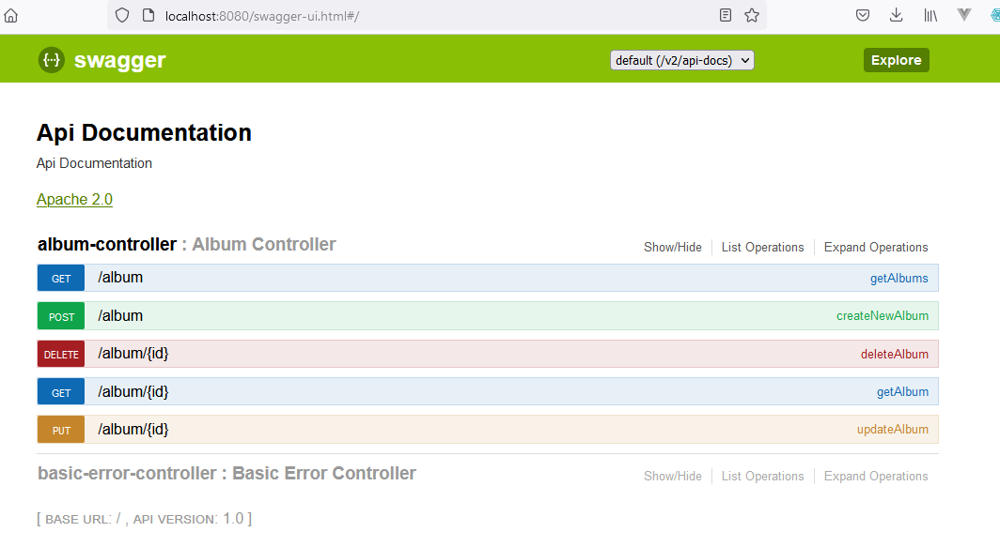
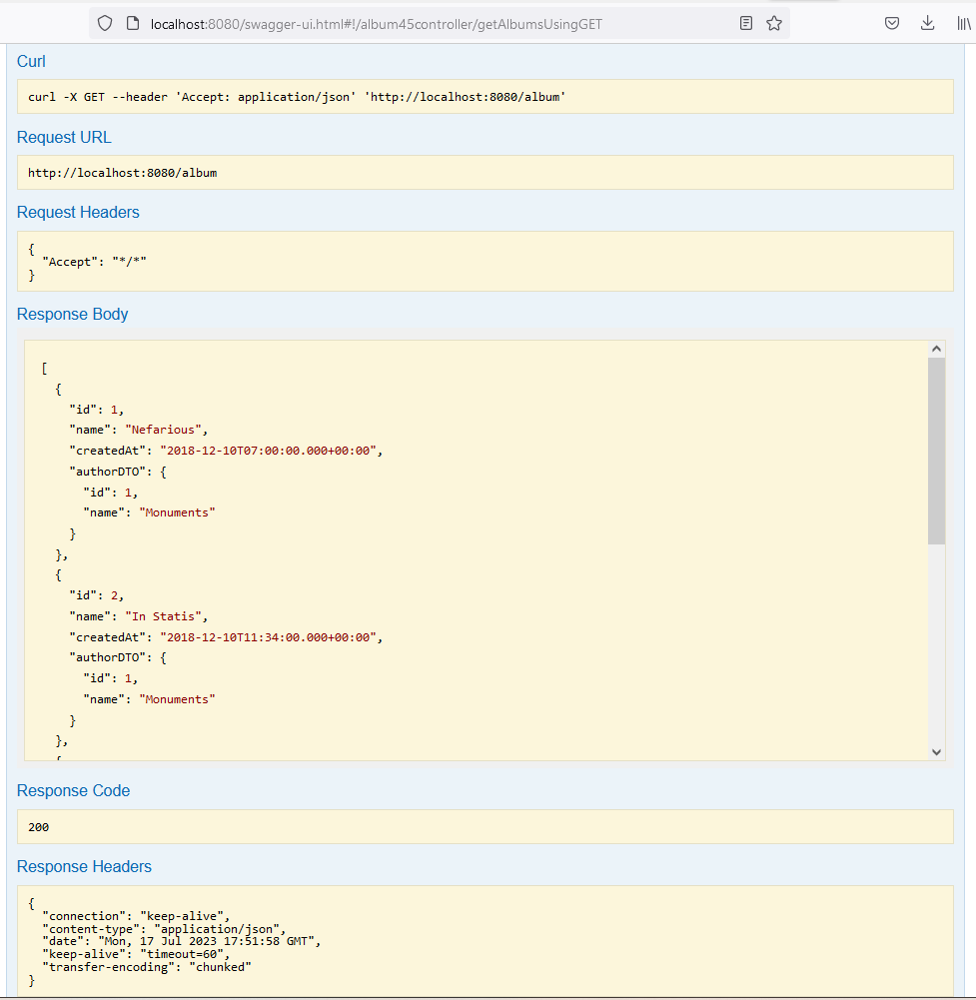

## Swagger


Documentar  API aplicando una configuración con Swagger:


**Listado - SwaggerConfig.java**

```java

@EnableSwagger2
@Configuration
public class SwaggerConfig {

    @Bean
    public Docket api(){
        return new Docket(DocumentationType.SWAGGER_2)
                .select()
                .apis(RequestHandlerSelectors.any())
                .paths(PathSelectors.any())
                .build()
                .pathMapping("/");
    }

}

```
Endpoints donde veremos la documentación que ha generado Swagger de forma automática de nuestra API.

* http://localhost:8080/
* http://localhost:8080/swagger-resources/configuration/ui
* http://localhost:8080/swagger-ui.html

Y esto es lo que veríamos, por ejemplo en la URL por defecto.

**Figura - Documentación web generada por Swagger**


Y esta sería la documentación generada en http://localhost:8080/swagger-ui.html, con una presentación amigable:




**Figura - JSON generador por swagger**


